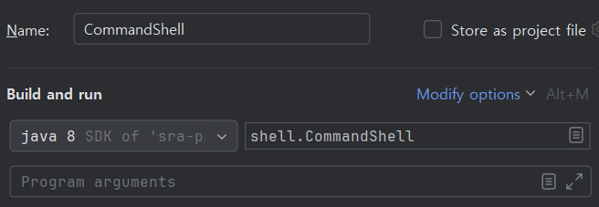
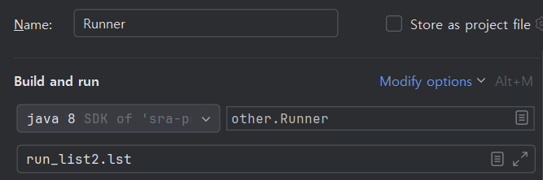

## 실행 방법

### 1. IntelliJ 환경
#### User Shell
shell.CommandShell.main() 실행


#### Runner
other.Runner.main() 실행
args 입력 필요


### 2. JVM 환경
```java
java -cp bin shell.CommandShell
java -cp bin shell.Runner run_list2.lst
```